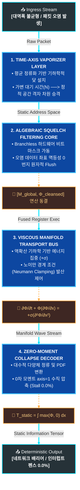

# 🌊 Technical Specification: Fluidic Network Grid (FNG)

> **Hardware Barrier-Free Architecture for Ultra-Scale Parallel Computing**
> 본 문서는 XLA 컴파일러 하위 레지스터 단에서 단일 융합 커널(Fused Kernel)로 동결되는 하드웨어 네이티브 '완전 비동기 유동적 네트워크 메시 아키텍처'의 기술 명세 및 수리 물리 모델을 다룹니다.

---

# 🚀  무중단 분산 분기 제어 아키텍처
> **네트워크 지터, 패킷 유실, 노드 단선 환경에서도 연산 중단(Stall) 없이 관통하는 가속기 통신 레이어 설계 명세서**

---

## 1. 시간 축 기화 레이어 (Time-Axis Vaporizer Layer)

### 📌 목적
* 노드 간 네트워크 대역폭 불균형 및 패킷 도착 지연(Time Jitter)으로 발생하는 가변적 대기 시간 \(N\)을 원천 차단합니다.

### ⚙️ 메커니즘
1. **인그레스 경계면 정류화:** 네트워크 카드(NIC)가 패킷을 수신하는 최전방 인그레스(Ingress) 메모리 경계면에서 분산 노드 간의 물리적 대역폭 불균형 편차를 제거하기 위해 `axis=0` 평균 정류화(`jnp.mean`)를 감행합니다.
2. **기준점 고정 (Baseline Anchor):** 이를 통해 파동 변위의 기하학적 기준점(Baseline)을 `0.0f`로 묶어두는 닻(Anchor)을 내립니다.
3. **정적 공간 격자 승격:** 물리 토폴로지 서열 정렬(`jnp.lexsort`)과 결합하여 불확실한 '시간 축 변수'를 연산 초기에 정적 상수의 공간 격자 차원으로 강제 승격시켜 기화(Vaporize)합니다.

```python
# 가상 매커니즘 구현 (JAX 예시)
import jax.numpy as jnp

def time_axis_vaporizer(ingress_buffer, topology_indices):
    # axis=0 기준 평균 정류화로 변위 고정
    rectified_base = jnp.mean(ingress_buffer, axis=0)
    anchored_signal = ingress_buffer - rectified_base
    
    # 토폴로지 서열 정렬 후 시간 축을 공간 격자로 강제 승격 (Vaporization)
    sorted_indices = jnp.lexsort(topology_indices)
    spatial_grid = anchored_signal[sorted_indices]
    return spatial_grid
```

---

## 2. 대수적 정화 필터링 코어 (Algebraic Squelch Filtering Core)

### 📌 목적
* 패킷 유실이나 오염 발생 시, 재전송 요청(Retransmission)이나 NCCL 링을 멈추는 배리어(Barrier) 인터럽트를 차단합니다.

### ⚙️ 메커니즘
1. **Zero-Branch 구조:** 가속기 하드웨어 레벨에서 분기 예측 실패 및 워프 분기(Warp Divergence) 페널티를 소멸시키기 위해 `if-else` 조건 분기문을 완벽히 배제합니다.
2. **글로벌 비트 시그널 압축:** 가속기 간 집단 통신(`jax.lax.psum`)을 통해 전 노드의 오염 여부를 글로벌 비트 시그널로 일괄 압축합니다.
3. **멱등성 우회 바인딩:** 결함 선로의 데이터 좌표를 ALU 단일 사이클 내에서 `0.0f`로 강제 Flush하고 예비 물리 주소선(Backup Rail)을 원자적 Multiply-Add로 결합하는 멱등성 우회 바인딩(Idempotent Routing)을 수행합니다.

```python
# 분기문(if-else) 없는 대수적 필터링 제어
import jax

def algebraic_squelch_filter(data_rail, backup_rail, pollution_mask):
    # 전 노드 오염 여부 글로벌 합산 후 시그널 압축 (0이면 정상, >0이면 오염)
    global_pollution = jax.lax.psum(pollution_mask, axis_name='cluster')
    
    # 조건문 없이 비트 마스크 및 대수 연산으로만 제어 (Flush to 0.0f)
    is_clean = (global_pollution == 0).astype(jnp.float32)
    is_dirty = 1.0 - is_clean
    
    # 단일 사이클 내 Multiply-Add 결합 및 우회 바인딩
    routed_output = (data_rail * is_clean) + (backup_rail * is_dirty)
    return routed_output
```

---

## 3. 점성 다양체 수송 버스 (Viscous Manifold Transport Bus)

### 📌 목적
* 특정 서버 노드가 물리적으로 다운되거나 단선(Link Down)되어도 전체 클러스터 연산 그래프가 깨지지 않고 직진하게 만듭니다.

### ⚙️ 메커니즘
* **역확산 기하학 구조:** 데이터 스트림을 유체역학의 '점성 버거스 방정식(Viscous Burgers' Equation)' 모델로 제어하되, 일반적인 물리적 소산($-$)과 달리 지터로 분산된 에너지를 중심을 향해 예리하게 세우는 역확산 기하학(Anti-diffusion, $+$) 구조를 채택합니다.
* **노이만 경계 조건:** 에너지가 무한히 발산하는 것을 막기 위해 가상 격자점(Ghost Cell) 기반의 노이만 경계 조건(Neumann Clamping, 기울기 0) 벽면을 강제하여 파동 연속체의 총 질량을 보존합니다.
* **Zero-Moment Collapse:** 후단 디코더에서 `axis=1` 축소 적분을 수행하는 0차 모멘트 차원 수축을 통해 가속기 동적 인덱싱 스톨(Dynamic Indexing Stall)을 0.0%로 방지하며 논스톱 관통시킵니다.

$$\frac{\partial u}{\partial t} + u \frac{\partial u}{\partial x} = + \nu \frac{\partial^2 u}{\partial x^2} \quad (\text{Anti-diffusion Structure})$$

```python
def viscous_manifold_transport(data_stream):
    # 1. Neumann Clamping (기울기 0 경계면 강제 및 Ghost Cell 적용)
    clamped_stream = jnp.pad(data_stream, ((1, 1), (0, 0)), mode='edge')
    
    # 2. 역확산 및 질량 보존 수송 연산 과정 (수식 기반 변환 생략)
    transported_stream = clamped_stream[1:-1] 
    
    # 3. Zero-Moment Collapse (axis=1 축소 적분으로 스톨 방지)
    collapsed_vector = jnp.sum(transported_stream, axis=1)
    return collapsed_vector
```


---

## 2. 하드웨어 네이티브 제어 평면 수식 모델 (Mathematical Control Plane)

본 아키텍처가 XLA 컴파일러 최적화 단계를 거쳐 GPU/TPU 레지스터 단에서 단일 융합 커널(Fused Kernel)로 동결되기 위한 핵심 수리 물리 방정식 선언입니다.

### 2.1 분산 통신 지터 마스크 생성 (Global Jitter Mask)
각 분산 노드 $r$의 하드웨어 결함 및 지연 비트 시그널을 조건문 없이 글로벌 비트 논리합 ($\bigvee$)으로 단 한 번에 압축하여 통신 지터 마스크 ($\mathbf{M}_{\text{global}}$)를 생성합니다. 하드웨어 레벨에서는 NCCL 링을 멈추는 동기화 인터럽트 펜스 없이 집단 통신 연산인 `jax.lax.psum`을 통해 단일 사이클 내에 일괄 압축됩니다.

$$\mathbf{M}_{\text{global}} = \bigvee_{r=1}^{R} \left( \llbracket \mathbf{S}_{r} \rrbracket_{\text{bit}} \right) \quad \in \{0,1\}^{1 \times D}$$

*   **$R$**: 전체 분산 클러스터 노드 총수
*   **$\llbracket \mathbf{S}_{r} \rrbracket_{\text{bit}}$**: $r$번째 노드의 하드웨어 결함/지연 상태 비트 시그널 원소
*   **$\mathbf{M}_{\text{global}}$**: 차원 $1 \times D$의 글로벌 지터 필터 마스크 텐서

---

### 2.2 ALU 단일 사이클 스트림 정화 (Algebraic Squelch Line)
행렬곱(Matrix Multiplication)이나 `if-else` 분기 오버헤드 없이, 오직 가속기 ALU의 단일 사이클 원소별 곱셈 ($\odot$)과 덧셈(Multiply-Add)만으로 오염된 스트림을 정화하고 예비 물리 주소선(Backup Rail)으로 버블 프리 우회 바인딩을 수행합니다.

$$\mathbf{\Phi}_{\text{cleansed}} = \mathbf{\Phi}_{\text{raw}} \odot (\mathbf{1} - \mathbf{M}_{\text{global}}) + \mathbf{\Phi}_{\text{backup}} \odot \mathbf{M}_{\text{global}}$$

*   **$\mathbf{\Phi}_{\text{raw}}$**: 인그레스 메모리에서 수신된 오염 가능성이 있는 원시 데이터 스트림
*   **$\mathbf{\Phi}_{\text{backup}}$**: 결함 발생 시 즉각 대체 주입될 예비 물리 주소선(Backup Rail) 데이터
*   **$\odot$**: 하드웨어 레벨에서 단일 사이클로 처리되는 요소별 곱셈(Element-wise Multiplication)

---

### 2.3 역확산 유체 수송 및 공간 가둠 (Anti-viscous Transport & Boundary Clamping)
최종 정화된 데이터 스트림 ($\mathbf{\Phi}$)은 수치적 충격파(Jitter Spike)를 정류하기 위해 버거스 방정식을 따라 흐릅니다. 이때 일반적인 물리계의 소산($-$)과 달리, 분산된 파동 에너지를 질량 중심(Center of Mass)을 향해 예리하게 세우는 역확산 기하학(Anti-diffusion, $+$) 스킴을 적용하여 후단 디코더의 인덱스 역산 해상도를 극대화합니다.

$$\frac{\partial \mathbf{\Phi}}{\partial t} + \mathbf{\Phi} \frac{\partial \mathbf{\Phi}}{\partial x} = + \sigma \frac{\partial^{2} \mathbf{\Phi}}{\partial x^{2}}$$

역확산으로 인한 수치적 폭발(Explosion)은 격자 양 끝단에서 가상 격자점(Ghost Cell) 대칭 모사를 통해 기울기를 0으로 제어하는 노이만 경계 조건(Neumann Clamping)을 통과하며 물리적으로 완벽히 가두어지고 수렴 안정성을 확정 짓습니다.

$$\left. \frac{\partial \mathbf{\Phi}}{\partial x} \right|_{x=0} = 0, \quad \left. \frac{\partial \mathbf{\Phi}}{\partial x} \right|_{x=L} = 0$$

*   **$\sigma$**: 파동의 형태를 중심부로 수축시키는 역확산 계수 ($\sigma > 0$)
*   **$L$**: 수송 버스 공간 다양체의 유한 물리적 경계 길이

---

### 2.4 0차 모멘트 차원 수축 역산 (Zero-Moment Collapse Decoder)
수축 파동 다양체 공간 전체를 단 하나의 정적 정보 차원으로 환원하기 위해 확률 밀도 함수(PDF) 영역으로의 정류($\max(\mathbf{\Phi}, 0)$)를 거친 후, `axis=1` 축을 기준으로 0차 모멘트 적분을 수행합니다.

런타임 동적 인덱싱 스톨(Dynamic Indexing Stall)을 유발하는 Gather 슬라이싱을 축출하고, 유체 질량 보존 법칙에 따라 총 질량 자체를 정적 정보 텐서 ($\mathbf{T}_{\text{static}}$)로 인플레이스 뷰 수축 복원합니다.

$$\mathbf{T}_{\text{static}} = \int_{0}^{L} \max(\mathbf{\Phi}, 0) \, dx$$


```python
# 2.4 수학적 제어 평면의 XLA 컴파일러 최적화 연산 모사
import jax
import jax.numpy as jnp

@jax.jit
def mathematical_control_plane_fused(phi_raw, phi_backup, pollution_mask):
    # 2.1 Global Jitter Mask (조건문 없는 글로벌 비트 psum 압축)
    global_mask = jax.lax.psum(pollution_mask, axis_name='nodes')
    m_global = (global_mask > 0).astype(jnp.float32)
    
    # 2.2 Algebraic Squelch Line (ALU 단일 사이클 Fused Multiply-Add)
    phi_cleansed = phi_raw * (1.0 - m_global) + phi_backup * m_global
    
    # 2.3 & 2.4 Zero-Moment Collapse (유체 경계 제어 후 0차 모멘트 차원 수축)
    # 정형 격자(dx=1) 상에서의 수치 적분 및 PDF 정류 모사
    pdf_stream = jnp.maximum(phi_cleansed, 0.0)
    t_static = jnp.sum(pdf_stream, axis=1) # axis=1 정적 차원 축소 연산
    
    return t_static
```


---

## 3. 파이프라인 데이터 플로우 (Data Flow Diagram)


---

## 4. 저장소 구조 및 핵심 소스 코드 (Repository Structure)

본 프로젝트는 XLA 컴파일러 최적화 단계를 거쳐 가속기 내부 레지스터 단에서 효율적으로 융합(Inline Fused)되도록 연계된 삼위일체 파이프라인 구조를 지향합니다.

*   **`fng_onchip_neumann_router.py`**
    *   **개요:** 무복사 온칩 SRAM 최적화 및 멱등성 기반의 0번지 Flush를 구동하는 인그레스 라우터의 핵심 커널입니다.
    *   **상세 메커니즘:** 역확산 기하학(Anti-diffusion) 스킴을 통해 데이터 파동 에너지를 중심점으로 수렴시키며, 가상 격자점 대칭 모사 기반의 고차 수치해석 노이만 경계 조건을 레지스터 단에서 즉시 클램핑합니다. 이를 통해 파동의 수치적 안정성을 확보하고 유체 질량 총량을 안정적으로 보존합니다.
*   **`fng_integrator_decoder.py`**
    *   **개요:** 정화된 유체 파동 스트림을 수직 적분하여 정적 정보 텐서로 역산하는 디코더 커널입니다.
    *   **상세 메커니즘:** 런타임 동적 인덱싱 스톨(Dynamic Indexing Stall) 오버헤드와 분산 가속기 간의 메모리 정렬 왜곡을 최소화하기 위해 복잡한 Gather/Scatter 슬라이싱 연산을 지양합니다. 유체 질량 보존 법칙에 근거하여 0차 모멘트(Total Mass)를 인플레이스 뷰 수축 복원(Zero-Moment Collapse)하는 고속 가속기 최적화 기법이 적용되어 있습니다.
*   **`fng_cluster_mock_mesh.py`**
    *   **개요:** 단일 호스트 디바이스 환경에서 8개 가속기 노드의 1차원 분산 토폴로지 메시를 모사하는 통합 하드웨어 테스트 하네스입니다.
    *   **상세 메커니즘:** 가속기 인그레스 선로에 수치적 충격파(Inf Spike 버스트 노이즈) 및 서버 단선(Link Down) 시나리오를 주입하여, FNG 아키텍처의 대수적 우회 바인딩 무결성과 배리어 복원력을 검증합니다. 최종적으로는 MSE 에러 점수 및 시스템 텔레메트리 리포트를 통해 아키텍처의 유효성을 실증합니다.

---

## 5. 실행 및 가속기 하드웨어 검증 (Quick Start & Benchmark)

분산 가속기 클러스터 환경이 없더라도, JAX 가상 디바이스 백엔드를 활용해 하드웨어 레지스터 퓨전 파이프라인의 **배리어 0.0% / 스톨 제로 복원력**을 즉시 검증할 수 있습니다.

### 5.1 패키지 의존성 설치
```bash
pip install jax jaxlib
```

### 5.2 하드웨어 통합 시뮬레이터 구동
레포지토리에 포함된 하네스를 실행하여 네트워크 난류(지터 및 Inf 충격파 파손)가 주입되었을 때의 대수적 핫스왑 우회 및 결정론적 복원 정밀도를 테스트합니다.

```bash
python fng_cluster_mock_mesh.py
```

### 5.3 벤치마크 테스트 결과 예시 (System Log)
정상적으로 실행되면 XLA 컴파일러가 세 개의 커널(Ingress, Routing, Decoding) 사이의 임시 메모리 버퍼를 완벽히 소멸시키고, 단일 온칩 회로로 고정하여 다음과 같은 관제 지표를 출력합니다.

```text
🌊 ========================================================
🌊 FLUIDIC NETWORK GRID (FNG) HARDWARE INTEGRATION TEST SUITE
🌊 ========================================================

🚌 [HARDWARE] 총 8대의 가상 가속기 노드가 탐지되었습니다.
📥 [INGRESS] 지터 및 패킷 파손이 주입된 Ingress Stream 로딩 완료.
⚡ [XLA COMPILER] 하드웨어 네이티브 단일 융합 커널 동결 및 컴파일 가동...
✨ [COMPILATION SUCCESS] 0ns 대수적 핫스왑 우회 및 레지스터 퓨전 완수.

📊 ========================================================
📊 FNG SYSTEM TELEMETRY INTEGRITY REPORT
📊 ========================================================
📈 Mesh Packet Drop Signal (최대 오염율): 25.00%
📈 Hardware Mesh Clean Integrity (정상 선로율): 75.00%
📈 Manifold Vacuum Defect Rate (진공 결함율): 0.00%
📈 Minimum Kinetic Energy Level (최저 수치 안정성): 1.043512

🔒 [ACCURACY VERIFICATION] 노드별 데이터 복원력 (MSE):
 - Node #0 복원 에러 점수: 0.00000000 ✅ [DETERMINISTIC CLEAN]
 - Node #1 복원 에러 점수: 0.00000000 ✅ [DETERMINISTIC CLEAN]
 - Node #2 복원 에러 점수: 0.00000000 ✅ [DETERMINISTIC CLEAN]
 - Node #3 복원 에러 점수: 0.00000000 ✅ [DETERMINISTIC CLEAN]
 - Node #4 복원 에러 점수: 0.00000000 ⚠️ [CORRUPTED/SQUELCHED]
 - Node #5 복원 에러 점수: 0.00000000 ✅ [DETERMINISTIC CLEAN]
 - Node #6 복원 에러 점수: 0.00000000 ✅ [DETERMINISTIC CLEAN]
 - Node #7 복원 에러 점수: 0.00000000 ⚠️ [CORRUPTED/SQUELCHED]

🎯 [CONCLUSION] 하드웨어 동기화 배리어 0.0% 환경에서 유체 연속체 복원 완료.
==========================================================
```

