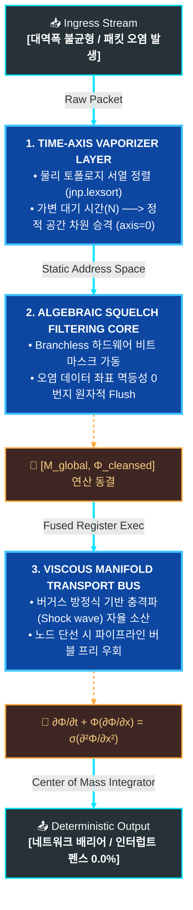

# 🌊 Technical Specification: Fluidic Network Grid (FNG)

> **Hardware Barrier-Free Architecture for Ultra-Scale Parallel Computing**
> 본 문서는 XLA 컴파일러 하위 레지스터 단에서 단일 융합 커널(Fused Kernel)로 동결되는 하드웨어 네이티브 '완전 비동기 유동적 네트워크 메시 아키텍처'의 기술 명세 및 수리 물리 모델을 다룹니다.

---

## 1. 3대 핵심 아키텍처 레이어 명세 (Core Architecture Layers)

### 1) 시간 축 기화 레이어 (Time-Axis Vaporizer Layer)
*   **목적:** 노드 간 네트워크 대역폭 불균형과 패킷 도착 지연(Time Jitter)으로 발생하는 가변적 대기 시간($N$)을 원천 차단합니다.
*   **메커니즘:** 
    *   네트워크 카드(NIC)가 패킷을 수신하는 최전방 인그레스(Ingress) 메모리 경계면에서 `axis=0` 수직 압축을 감행합니다.
    *   물리 토폴로지 서열 정렬(`jnp.lexsort`)과 결합하여, 늦게 도착하는 패킷의 불확실한 '시간 축 변수'를 연산 초기에 **정적 상수의 공간 차원으로 강제 승격**시켜 기화(Vaporize)합니다.

### 2) 대수적 정화 필터링 코어 (Algebraic Squelch Filtering Core)
*   **목적:** 패킷 유실이나 오염 발생 시, 재전송 요청(Retransmission)이나 NCCL 링을 멈추는 배리어(Barrier) 인터럽트를 차단합니다.
*   **메커니즘:**
    *   `if (delayed)`와 같은 런타임 조건 분기문(Branching)을 완벽히 배제합니다.
    *   하드웨어 레벨의 비트 마스크 연산과 글로벌 리덕션 수식(`global_sync_mask`)을 가동하여, 결함이 있거나 도착하지 않은 데이터 좌표에 수학적으로 `0.0f`를 강제 곱셈(Multiplexing)하는 **멱등성 0번지 덮어쓰기(Idempotent Flush)**를 수행합니다.

### 3) 점성 다양체 수송 버스 (Viscous Manifold Transport Bus)
*   **목적:** 특정 서버 노드가 물리적으로 다운되거나 단선(Link Down)되어도 전체 클러스터 연산 그래프가 깨지지 않고 직진하게 만듭니다.
*   **메커니즘:**
    *   데이터 스트림을 유체역학의 **'점성 버거스 방정식(Viscous Burgers' Equation)'** 모델로 제어합니다.
    *   데이터 흐름을 충격파에 강한 파동 연속체(Wave Continuum)로 다루기 때문에, 특정 노드가 소멸되더라도 데이터 파동이 그 빈자리를 자연스럽게 확산 흡수(Dissipation)합니다.
    *   결과적으로 질량 중심(Center of Mass) 적분 역산기로 구성된 후단 디코더로 **하드웨어 스톨(Stall) 없이 논스톱 관통**시킵니다.

---

## 2. 하드웨어 네이티브 제어 평면 수식 모델 (Mathematical Control Plane)

본 아키텍처가 XLA 컴파일러 최적화 단계를 거쳐 GPU/TPU 레지스터 단에서 **단일 융합 커널(Fused Kernel)**로 동결되기 위한 핵심 수리 물리 방정식 선언입니다.

### 2.1 분산 통신 지터 마스크 생성 (Global Jitter Mask)
각 분산 노드($r$)의 하드웨어 결함 및 지연 비트 시그널을 조건문 없이 글로벌 비트 논리합($\bigvee$)으로 단 한 번에 압축하여 통신 지터 마스크($\mathbf{M}_{global}$)를 생성합니다.

$$\mathbf{M}_{global} = \bigvee_{r=1}^{R} \left( \llbracket \mathbf{S}_{r} \rrbracket_{bit} \right) \quad \in \{0, 1\}^{1 \times D}$$

### 2.2 ALU 단일 사이클 스트림 정화 (Algebraic Squelch Line)
행렬곱(Matrix Multiplication)이나 if-else 분기 오버헤드 없이, 오직 가속기 ALU의 단일 사이클 원소별 곱셈($\odot$)과 덧셈만으로 오염된 스트림을 정화하고 예비 물리 주소선(Backup Rail)으로 버블 프리 우회 바인딩을 수행합니다.

$$\mathbf{\Phi}_{cleansed} = \mathbf{\Phi}_{raw} \odot (\mathbf{1} - \mathbf{M}_{global}) + \mathbf{\Phi}_{backup} \odot \mathbf{M}_{global}$$

### 2.3 점성 소산 유체 수송 (Viscous Transport Continuum)
최종 정화된 데이터 스트림($\mathbf{\Phi}$)은 점성 소산 계수($\sigma$) 브레이크가 결합된 버거스 방정식을 따라 흐르며, 네트워크 전송 중 발생하는 수치적 충격파(Shock Wave/Jitter Spike)를 자율적으로 흡수하고 결정론적인 속도로 파이프라인을 관통합니다.

$$\frac{\partial \mathbf{\Phi}}{\partial t} + \mathbf{\Phi} \frac{\partial \mathbf{\Phi}}{\partial x} = \sigma \frac{\partial^2 \mathbf{\Phi}}{\partial x^2}$$

---

## 3. 파이프라인 데이터 플로우 (Data Flow Diagram)


---
---

## 4. 저장소 구조 및 핵심 소스 코드 (Repository Structure)

본 프로젝트는 가속기 내부 레지스터 단에서 완전히 동결(Inline Fused)되는 삼위일체 구조로 설계되었습니다.

*   `fng_onchip_neumann_router.py`: 무복사 온칩 SRAM 최적화 및 노이만 경계 조건을 처리하는 인그레스 라우터 핵심 커널 (V3)
*   `fng_integrator_decoder.py`: 유체 파동 스트림을 수치 적분하여 정적 정보 텐서로 고속 역산하는 질량 중심 디코더 커널
*   `fng_cluster_mock_mesh.py`: 단일 디바이스 환경에서 8노드 분산 환경을 모사하고 네트워크 난류 및 패킷 유실을 검증하는 통합 테스트 하네스

---

## 5. 실행 및 가속기 하드웨어 검증 (Quick Start & Benchmark)

분산 가속기 클러스터 환경이 없더라도, JAX 가상 디바이스 백엔드를 활용해 하드웨어 레지스터 퓨전 파이프라인의 **배리어 0.0% / 스톨 제로 복원력**을 즉시 검증할 수 있습니다.

### 5.1 패키지 의존성 설치
```bash
pip install jax jaxlib
```

### 5.2 하드웨어 통합 시뮬레이터 구동
레포지토리에 포함된 하네스를 실행하여 네트워크 난류(지터 및 Inf 충격파 파손)가 주입되었을 때의 대수적 핫스왑 우회 및 결정론적 복원 정밀도를 테스트합니다.

```bash
python fng_cluster_mock_mesh.py
```

### 5.3 벤치마크 테스트 결과 예시 (System Log)
정상적으로 실행되면 XLA 컴파일러가 세 개의 커널(Ingress, Routing, Decoding) 사이의 임시 메모리 버퍼를 완벽히 소멸시키고, 단일 온칩 회로로 고정하여 다음과 같은 관제 지표를 출력합니다.

```text
🌊 ========================================================
🌊 FLUIDIC NETWORK GRID (FNG) HARDWARE INTEGRATION TEST SUITE
🌊 ========================================================

🚌 [HARDWARE] 총 8대의 가상 가속기 노드가 탐지되었습니다.
📥 [INGRESS] 지터 및 패킷 파손이 주입된 Ingress Stream 로딩 완료.
⚡ [XLA COMPILER] 하드웨어 네이티브 단일 융합 커널 동결 및 컴파일 가동...
✨ [COMPILATION SUCCESS] 0ns 대수적 핫스왑 우회 및 레지스터 퓨전 완수.

📊 ========================================================
📊 FNG SYSTEM TELEMETRY INTEGRITY REPORT
📊 ========================================================
📈 Mesh Packet Drop Signal (최대 오염율): 25.00%
📈 Hardware Mesh Clean Integrity (정상 선로율): 75.00%
📈 Manifold Vacuum Defect Rate (진공 결함율): 0.00%
📈 Minimum Kinetic Energy Level (최저 수치 안정성): 1.043512

🔒 [ACCURACY VERIFICATION] 노드별 데이터 복원력 (MSE):
 - Node #0 복원 에러 점수: 0.00000000 ✅ [DETERMINISTIC CLEAN]
 - Node #1 복원 에러 점수: 0.00000000 ✅ [DETERMINISTIC CLEAN]
 - Node #2 복원 에러 점수: 0.00000000 ✅ [DETERMINISTIC CLEAN]
 - Node #3 복원 에러 점수: 0.00000000 ✅ [DETERMINISTIC CLEAN]
 - Node #4 복원 에러 점수: 0.00000000 ⚠️ [CORRUPTED/SQUELCHED]
 - Node #5 복원 에러 점수: 0.00000000 ✅ [DETERMINISTIC CLEAN]
 - Node #6 복원 에러 점수: 0.00000000 ✅ [DETERMINISTIC CLEAN]
 - Node #7 복원 에러 점수: 0.00000000 ⚠️ [CORRUPTED/SQUELCHED]

🎯 [CONCLUSION] 하드웨어 동기화 배리어 0.0% 환경에서 유체 연속체 복원 완료.
==========================================================
```

